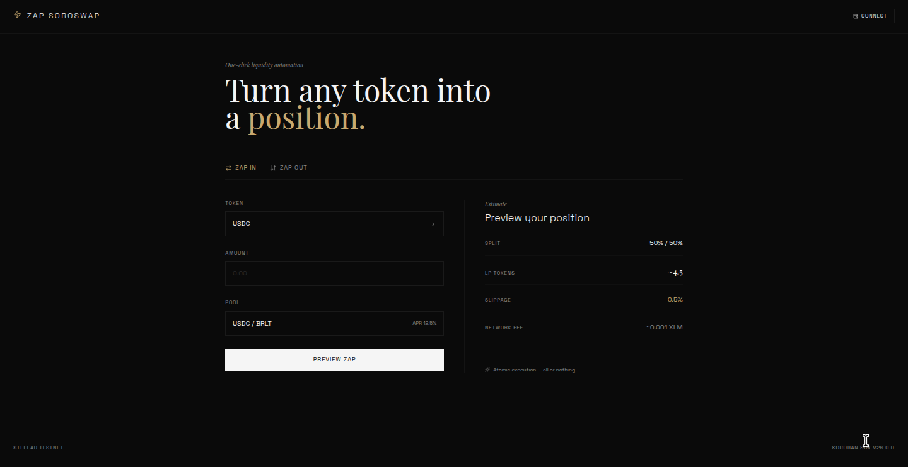

 <div align="center">


# ⚡ Zap Soroswap

**One-click liquidity automation on Stellar.**  
Zap any token into Soroswap LP positions — and zap back out to any token you want.

[](https://developers.stellar.org/)
[](https://soroban.stellar.org/)
[](#-tests)
[](LICENSE)

[Getting Started](#-getting-started) · [Features](#-features) · [Architecture](#-architecture) · [Deploy](#-deploy) · [Tests](#-tests)

</div>

---

## 🧠 The Problem

Adding liquidity to a DEX is painful. You need to:

1. Swap token A for 50% of token B
2. Approve token A
3. Approve token B
4. Call `addLiquidity()`

That's **4+ transactions**, manual math, multiple slippage exposures, and failed UX.

## ⚡ The Solution

```
You have: 100 XLM
You want: USDC/XLM LP position

Zap In → done. One transaction. One click.
```

Zap Soroswap wraps all of that complexity into a single **atomic on-chain call** on Soroban.

---

## ✨ Features

| Feature | Description |
|:--------|:------------|
| **⚡ Zap In** | Single token → LP position in one atomic transaction |
| **💸 Zap Out** | LP position → single token of your choice |
| **🔍 Preview** | Simulate estimates before committing any funds |
| **🔒 Renounce Admin** | Permanently remove contract admin for trustless usage |
| **🛡️ All-or-nothing** | Atomic execution — no partial fills, no stuck funds |

---

## 🚀 Getting Started

### Prerequisites

- [Rust](https://rustup.rs/) with `wasm32-unknown-unknown` target
- [Stellar CLI](https://developers.stellar.org/docs/tools/developer-tools/cli/install-cli)
- Node.js 18+ (for frontend)

```bash
# Install Rust WASM target
rustup target add wasm32-unknown-unknown
```

### Clone & Build

```bash
git clone https://github.com/catitodev/zap-soroswap.git
cd zap-soroswap/contracts

# Run tests
cargo test

# Build contract
cargo build --target wasm32-unknown-unknown --release
```

### Frontend

```bash
cd frontend
npm install
npm run dev
```

---

## 🏗️ Architecture

```
zap-soroswap/
├── contracts/              # Soroban smart contracts (Rust)
│   ├── src/
│   │   ├── lib.rs          # Contract entrypoint
│   │   ├── zap_in.rs       # Zap In logic
│   │   ├── zap_out.rs      # Zap Out logic
│   │   └── preview.rs      # Simulation & estimates
│   ├── Cargo.toml
│   └── Makefile
├── frontend/               # React 19 + Vite 6 + Tailwind v4
│   ├── src/
│   │   ├── components/     # UI components
│   │   ├── hooks/          # Contract interaction hooks
│   │   └── utils/          # Helpers & formatters
│   └── package.json
├── backend/                # API server
│   └── src/
└── docs/                   # Documentation
```

### Contract Flow

```
User Input (token + amount)
        │
        ▼
  ┌─────────────┐
  │   Preview   │ ←── Estimate output before execution
  └─────────────┘
        │
        ▼
  ┌─────────────┐
  │   Zap In    │ ──► Swap 50% → Add Liquidity → Mint LP (atomic)
  └─────────────┘
        │
        ▼
  ┌─────────────┐
  │   Zap Out   │ ──► Burn LP → Swap to target token (atomic)
  └─────────────┘
```

---

## 📡 Deploy

### 1. Setup wallet

```bash
stellar keys generate --global deployer --network testnet
stellar keys fund --network testnet deployer
```

### 2. Deploy contract

```bash
stellar contract deploy \
  --wasm target/wasm32-unknown-unknown/release/zap_contract.wasm \
  --source-account deployer \
  --network testnet
```

### 3. Initialize

```bash
stellar contract invoke \
  --id <CONTRACT_ID> \
  --source deployer \
  --network testnet \
  -- initialize \
  --admin <ADMIN_ADDRESS> \
  --soroswap_router <ROUTER_ADDRESS>
```

> **Tip:** Run `stellar contract deploy --help` for the full list of options.

---

## 🧪 Tests

```bash
cd contracts && cargo test
```

```
running 5 tests
test test_initialize            ... ok
test test_preview_zap_in        ... ok
test test_renounce_admin        ... ok
test test_zap_in_amount_too_low ... ok
test test_zap_in_success        ... ok

test result: ok. 5 passed; 0 failed; 0 ignored
```

---

## 🛠️ Stack

| Layer | Technology |
|:------|:-----------|
| **Smart Contract** | Rust · Soroban SDK v26.0.0 |
| **Network** | Stellar · Protocol 26 |
| **Frontend** | React 19 · Vite 6 · Tailwind CSS v4 |
| **Backend** | Node.js API server |
| **Testing** | Cargo test · Soroban test env |

---

## 🔐 Security

- All swaps and liquidity operations are **atomic** — if any step fails, the entire transaction reverts
- Admin can be **permanently renounced** via `renounce_admin()` for trustless deployment
- Preview function allows **off-chain simulation** before spending gas
- No user funds are held by the contract between calls

---

## 🤝 Contributing

Contributions, issues, and feature requests are welcome.

```bash
# Fork → Branch → Commit → PR
git checkout -b feature/your-feature
git commit -m "feat: add your feature"
git push origin feature/your-feature
```

Please make sure all tests pass before submitting a PR.

---

## 📄 License

Distributed under the [Apache 2.0 License](LICENSE).

---

<div align="center">

Developed with ⚡ by **[catitodev](https://github.com/catitodev)**

</div>


---

## 🚀 Deploy Info

| Network | Testnet |
|:--------|:--------|
| **Contract ID** | `CASWRPDU7ZY3FKXPHUDYGFNPDZX6FJBLPHTZOOLF7PACFRZZ6JCRLG3Z` |
| **Soroswap Router** | `CCJUD55AG6W5HAI5LRVNKAE5WDP5XGZBUDS5WNTIVDU7O264UZZE7BRD` |
| **Admin** | `GBKIGI6OAERZFIZPMOOUSR7VA7IY3FB57YE6W3OUS36QXE4KZYKMSRBK` |
| **Max Slippage** | 1% |
| **Min Amount** | 1000 |

[View on Stellar Expert](https://stellar.expert/explorer/testnet/contract/CASWRPDU7ZY3FKXPHUDYGFNPDZX6FJBLPHTZOOLF7PACFRZZ6JCRLG3Z)

---

## 🖼️ Frontend Preview



*Minimalist editorial design — Space Grotesk + Playfair Display typography*
